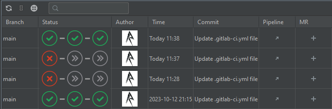

# Gitlab Pipelines

Cloned and modified from: [Gitlab Pipeline Viewer](https://gitlab.com/ppiag/intellij_gitlab_pipeline_monitor.git)

<!-- Plugin description -->
**Gitlab Pipelines** allows you you track gitlab build pipelines for your projects directly from inside IntelliJ and other Jetbrains products.

<!-- Plugin description end -->

## Overview

This plugin allows you to monitor and display pipelines run on gitlab. Both gitlab.com and self-hosted instances are supported.

Example screenshot:

By default all pipelines for tags and locally checked out branches are monitored. For each branch up to 200 piplines will be displayed. If an open merge request exists, a link to it will
be shown, otherwise a link to open a new one.

When the plugin detects a git remote that is unknown it try to determine if it's hosted on gitlab and find the correct host and project path. It will display a balloon notification: 

When you have time click the first action in it and a dialog will appear, asking you if you want to monitor pipelines for this remote (assuming it's associated with a gitlab project): 

If you want to save tokens for longer than the lifetime of an IDE instance please make sure that they're actually saved: <a href="jetbrains://idea/settings?name=Appearance+%26+Behavior--System+Settings--Passwords">File | Settings |
Appearance & Behavior | System Settings | Passwords</a>

## Troubleshooting

Unfortunately gitlab returns an empty response if access to a private project was not possible due to an auth error. Therefore the plugin can't tell if the gitlab host is wrong, the project path is wrong or an invalid access token was used.
Make sure the values entered are correct. You can check and edit them at any time in the settings.

You can enable debug logging by opening Help -> Diagnostic Tools -> Debug Log Settings and adding the value `#org.rett`.

The log can then be found using Help -> Show Log in Explorer.